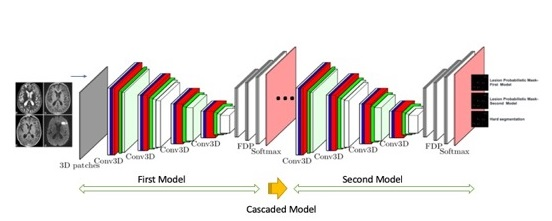
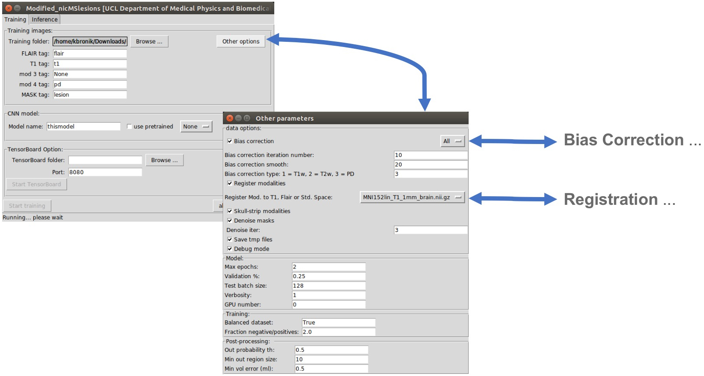
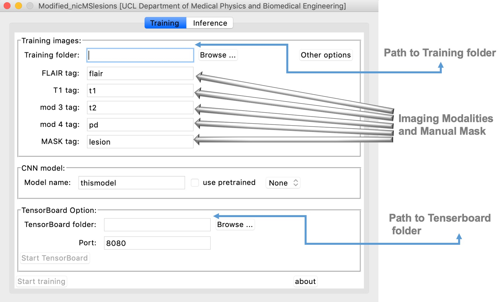
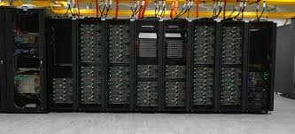

# MS_CNN
[This is a modified version of nicMSlesions (https://github.com/NIC-VICOROB/nicMSlesions)]
<br>
 
 </br>

# This  version support additionally the following functionalities: 
<dl>
  <dt>(1) Runnable on a Mac system/computer</dt>
  <dt>(2) Cold start and warm start support:</dt>
  <dd>- Allowing to re-create the architecture of the model</dd>
  <dd>- Allowing to use the saved weights of the model</dd>
  <dd>- Allowing to use  the training configuration and avoiding to run preprocessing again</dd>
  <dd>- Allowing to resume training exactly where it left off(interrupting the training is     
    allowed throughout the training process)</dd>
  <dd>- Allowing to use pretrained model</dd>
  <dt>(3) Supporting Python 3</dt>
  <dt>(4) Integrated Tensorborad [to provide the measurements and visualisations of TensorFlow execution (to understand, debug, and optimisation of  the TensorFlow programs)]</dt>
  <dt>(5) Checking whether a file or directory is relevant for Training and Testing</dt> 
  <dt>(6) Easy HPC (High Performance Computing) support</dt> 
  <dt>(7) Bias correction of masks using FSL</dt>
  <dt>(8) Registration, moving all images to the Flair, T1 or Standard space</dt>
</dl>

<br>
 
 </br>


<br>
 
 </br>
# Running the Program!

This modified version can be run with or without a GUI (similar to original version)

After lunching the graphical user interface, user will need to provide necessary information to start training/testing as follows:  

<br>
 
 </br>
 
 # 
# Running the Program on the HPC cluster using NVIDIA GPUs(without any additional library/dependency installation):
<br>
 
 </br>
 
 
First, user will need to be sure that "singularity" 
https://singularity.lbl.gov/
is available on local or remote machine.


Then:


```sh
  - singularity pull docker://kbronik/ms_cnn_ucl:latest  
``` 
After running the above, a singularity image using docker hub (docker://kbronik/ms_cnn_ucl:latest) will be generated:
```sh
  - path to singularity//..///ms_cnn_ucl_latest.sif  
``` 
Finally:

```sh
  - singularity run --nv   (path to singularity)//..///ms_cnn_ucl_latest.sif  python  (path to nicpython36)/nic_train_network_batch.py (or other nic-python code)
```
<br>
 
 </br>


# For an interactive session:

```sh
  - singularity shell   (path to singularity)//..///ms_cnn_ucl_latest.sif 
```
Then:

```sh
  - source activate idp
  - python (path to nicpython36)/app.py
```
# For an interactive session (TensorFlow on CPU only): 
```sh
  - singularity exec  docker://kbronik/ms-ucl-cnn-cpu:CPU_Latest  python  (path to nicpython36)/app.py 
```
